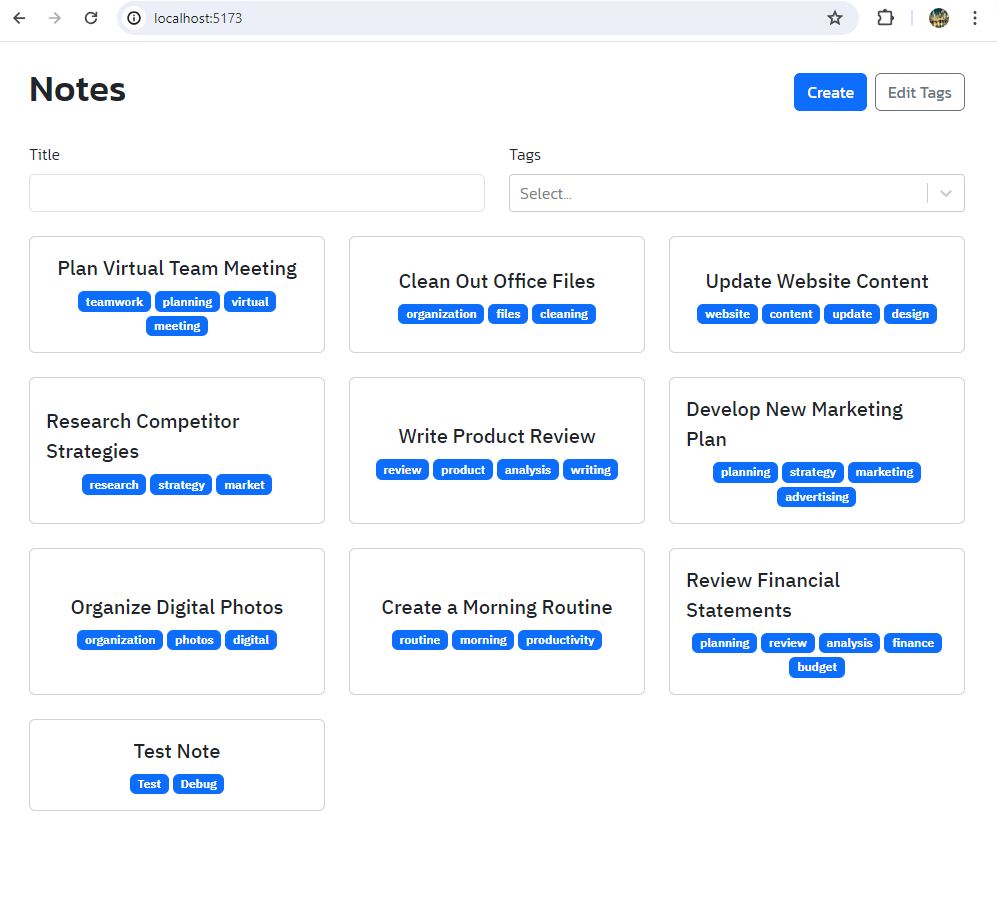
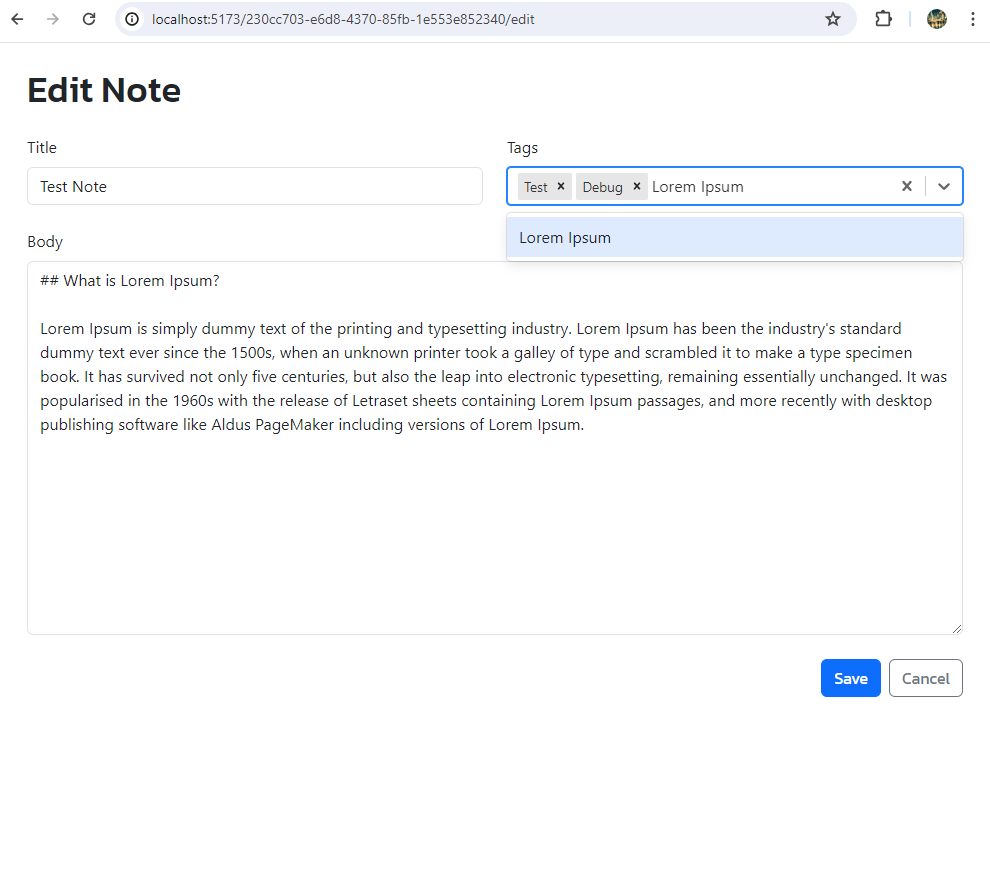
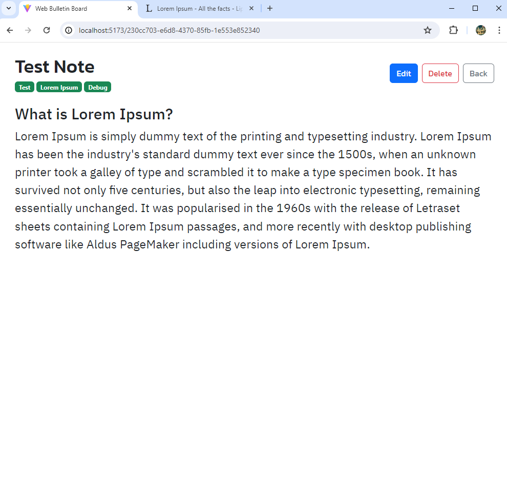

# Note Storage App

This application is a simple note storage system built with React and TypeScript. Each note in the system has a title containing a body and tags, uses search functionality to filter notes by title/tags and react-markdown which supports markdown syntax for rich text formatting. The application uses local storage to persist notes between sessions.

## Features

- **Create Notes**: Users can create new notes with a title, description, and markdown content.
- **Edit Notes**: Existing notes can be edited. The changes are saved to local storage.
- **Delete Notes**: Users can delete notes. The deletion is reflected in local storage.
- **Markdown Support**: The application supports markdown syntax for note content. This allows users to format their notes with headers, bold text, links, and other markdown features.
- **Tagging**: Each note can be associated with multiple tags for easy categorization and retrieval.

Special mention to @WebDevSimplified and his guide which this project was based from.

## Running the App

To run the application, first install the dependencies with `npm install`, then start the development server with `npm start`.

## Building the App

To build the application for production, run `npm run build`.

Please refer to the individual files for more detailed information about each component.
